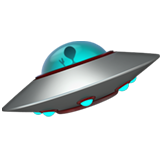

  
   
  UFO - Use fetch orderly
   
  react-ufo is a collection of react hooks to help you handle data fetching with no fuss

## Disclamer

These APIs are experimental and there might be some API change before a stable version is released.
Use the unstable version at your own risk.

## Installation

`npm install --save react-ufo`

## Examples

If you want to invoke a remote API inside an event callback: <a href="https://github.com/marcellomontemagno/react-ufo/blob/master/src/FetchCallbackExample.js" target="_blank">Fetch Callback Example</a> 
If you want to invoke a single API on mount/update: <a href="https://github.com/marcellomontemagno/react-ufo/blob/master/src/FetchEffectExample.js" target="_blank">Fetch Effect Examplele</a> 
If you want to invoke multiple APIs depending on each other: <a href="https://github.com/marcellomontemagno/react-ufo/blob/master/src/CascadingFetchesExample.js" target="_blank">Cascading Fetches Example</a> 

## Dependencies

This package has zero dependencies but in order to support fetches abortion you will need  <a href="https://developer.mozilla.org/en-US/docs/Web/API/AbortController" target="_blank">AbortController</a> (or a polyfill such as <a href="https://www.npmjs.com/package/abortcontroller-polyfill" target="_blank">abortcontroller-polyfill</a>) in your environment